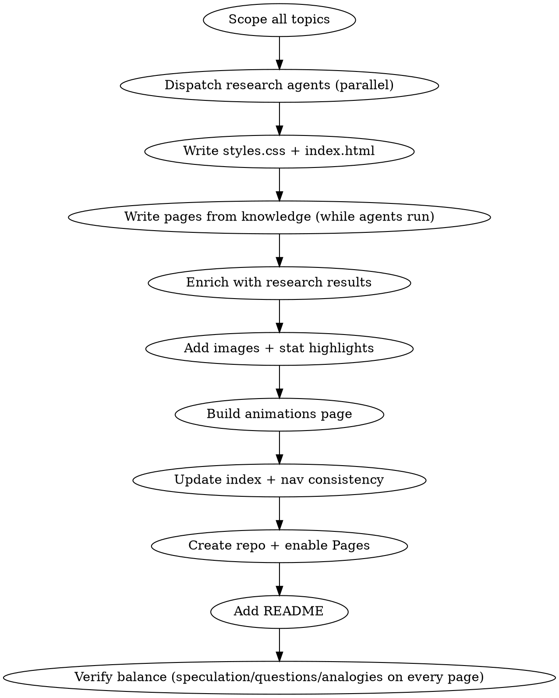

# Knowledge Base Website

## Overview

Build a rich, interconnected, multi-page educational website from scratch — researched in depth, visually immersive, with interactive animations, and deployed to GitHub Pages. Zero dependencies. Pure HTML/CSS/JS.

## When to Use

- User wants a deep-dive educational site on any topic
- Request for a "visual explainer", "learning companion", or "knowledge base"
- Multi-section exploration of a complex subject
- Needs to be shareable as a hosted website
- User wants something beautiful, immersive, and information-dense

## Architecture Pattern

```
project/
  index.html          # Landing page with card grid linking all sections
  styles.css          # Shared CSS (dark theme, all component styles)
  [section].html      # One page per topic (self-contained, interlinked)
  animations.html     # Interactive visualisations page
  README.md           # GitHub README with hero image and section index
```

**Key principle:** Each page is self-contained (own hero, nav, content, prev/next) but shares styles.css and consistent navigation. No build step. No dependencies. Opens directly in a browser.

## Content Architecture Per Page

Every section page follows this anatomy:

```
Hero (background image + title + subtitle)
Nav bar (sticky, links to ALL pages, highlights current)
Section content:
  ├── Stat strip (key numbers in large gold type)
  ├── Image cards (NASA/official imagery with captions)
  ├── Explanation blocks (amber left-border, h4 + paragraphs)
  ├── Analogies (green left-border, italic, makes numbers tangible)
  ├── Formulas (centred monospace blocks)
  ├── Question boxes (blue border, unanswered frontiers)
  └── Speculation boxes (pink border, "SPECULATION" label, caveat at bottom)
Prev/Next navigation
Footer
```

## Research Phase

1. **Identify all topics** — map the full scope before writing anything
2. **Parallel research agents** — dispatch background agents for topics needing specific data (dates, numbers, URLs, paper references)
3. **Write pages you can do from knowledge** while agents research
4. **Enrich with agent results** — add specific numbers, dates, proper nouns, image URLs when research returns

**Research agent prompts should ask for:**
- Specific numbers and measurements
- Dates of discovery/publication
- Names of people involved
- Direct image URLs from official sources
- Paper references with DOIs or bibcodes
- The significance/context of each finding

## Visual Design System

### Colour Palette (Dark Space Theme)
```css
Background:     #0a0a0f
Text:           #e0e0e8
Gold accent:    #f0c27f  (headings, highlights, numbers)
Blue accent:    #6a82fb  (questions, links)
Pink accent:    #fc5c7d  (speculation, warnings)
Green accent:   #5a9     (analogies)
Muted:          #889     (secondary text)
Dark card:      #12121a  (image card backgrounds)
```

### Component Styles

**stat-inline:** Flex row of stat cards with large numbers — use for key metrics at section tops
**image-card:** Full-width image with caption below, subtle hover zoom
**explanation:** Amber left-border block for factual content
**analogy:** Green left-border italic block — makes abstract numbers tangible
**formula:** Centred monospace for equations
**question-box:** Blue-bordered box with "?" bullets for open questions
**speculation-box:** Pink-bordered with "SPECULATION" label badge, includes `.caveat` at bottom

### Key Design Principles

- **Dark background, light text** — space/science aesthetic, reduces eye strain
- **Gold for emphasis** — numbers that matter, section headings, interactive elements
- **Every number needs context** — never state a measurement without a human-scale analogy
- **Images break up text** — no section should be more than 2 explanation blocks without a visual
- **Sticky nav bar** — always know where you are, always able to jump

## Writing Style

### The Voice
- Expert teacher explaining to an intelligent non-specialist
- Vivid, not dry. Excited, not breathless.
- Use numbers — then immediately make them tangible with an analogy
- First-person-plural where appropriate ("we're seeing...", "we observe...")

### The Analogy Pattern
Every hard concept gets an analogy that:
1. Uses something from everyday engineering/life
2. Maps precisely to the physics (not just "kinda like")
3. Identifies where the analogy breaks down (if non-obvious)

### The Speculation Pattern
Each speculation section:
1. States the established physics clearly
2. Extends it with a "what if" that connects observations
3. Identifies what would need to be true
4. Ends with a `.caveat` — honest about confidence level and current research status

### The Question Pattern
Questions should be:
- Genuinely unanswered (not rhetorical)
- Specific enough to be research programmes
- Exciting (the reader should think "I want to know that too")

## Interactive Animations (Canvas API)

### When to Animate
- Physical processes with time evolution (waves, orbits, transits)
- Mechanisms with moving parts (microshutters, deployment)
- Concepts where interactivity aids understanding (lensing, parameter sliders)

### Animation Structure
```javascript
(function() {
    const canvas = document.getElementById('name-canvas');
    const ctx = canvas.getContext('2d');
    // Self-contained IIFE — no global state pollution
    // Slider/button event listeners
    // draw() function called on input change or animation frame
    // Always include initial draw() call
})();
```

### Animation Explainer Pattern
Every animation gets a two-column explainer below:
- **"What you're seeing"** — describes the physics being visualised
- **"So what?"** — explains why this matters for JWST's mission

### Design Requirements
- Dark background matching site theme (#0d0d14)
- Gold accent colour for interactive elements
- Subtle glow/shadow effects (not garish)
- Controls: range sliders + buttons, styled consistently
- Responsive canvas width (CSS width: 100%)

## Image Sourcing

### Official NASA/STScI Images
- Primary source: `assets.science.nasa.gov/dynamicimage/assets/science/missions/webb/...`
- Supports `?w=1200&fit=clip&crop=faces%2Cfocalpoint` for responsive sizing
- All NASA/ESA/CSA/STScI images are public domain
- Always include credit line in caption

### People Photos
- NASA portraits: `www.nasa.gov/wp-content/uploads/...`
- Science team: `science.nasa.gov/wp-content/uploads/...`
- Style: 200px circles/rounded squares with name and role below

### Image Card Pattern
```html
<div class="image-card">
    
    <div class="caption">
        <h3>[Title — Object Name]</h3>
        <p>[2-3 sentences: what you're looking at, what's remarkable, what's new]</p>
        <p class="credit">Credit: NASA, ESA, CSA, STScI, [specific team]</p>
    </div>
</div>
```

## Deployment

### GitHub Pages Setup
```bash
# 1. Init repo
git init && git add -A
git commit -m "Initial commit: [topic] knowledge base"

# 2. Create repo (public for free Pages)
gh repo create [username]/[repo] --public --description "[description]" --source=. --push

# 3. Enable Pages
gh api repos/[username]/[repo]/pages -X POST -f "source[branch]=main" -f "source[path]=/"

# Site live at: https://[username].github.io/[repo]/
```

### README Pattern
- Hero image (full-width from the topic)
- Centred title with badges (page count, animations count, zero deps)
- Prominent link to live site
- Table of all sections with one-line descriptions
- Closing image and quote
- Credits section

## Workflow Summary



## Quality Checklist

For each page verify:
- [ ] Has at least one image
- [ ] Has stat-inline strip with key numbers
- [ ] Has 2+ analogies making concepts tangible
- [ ] Has a question box (unanswered frontiers)
- [ ] Has a speculation box (deeper meaning / "so what")
- [ ] Nav bar links to ALL pages and highlights current
- [ ] Prev/next navigation at bottom
- [ ] No wall of text longer than 2 explanation blocks without a visual break
- [ ] All numbers have human-scale context

For the full site verify:
- [ ] Index page has card grid with all sections
- [ ] Animations page with explainers
- [ ] README with live site link
- [ ] Consistent nav across every page
- [ ] GitHub Pages enabled and live

## Common Mistakes

| Mistake | Fix |
|---------|-----|
| Wall of text with no images | Add image cards every 2-3 explanation blocks |
| Numbers without context | Add analogy immediately after every large/small number |
| Speculation without caveat | Always end speculation-box with `.caveat` paragraph |
| Nav bar out of sync across pages | Update ALL pages when adding a new section |
| Missing "so what" | Every section needs a reason the reader should care |
| Generic stock imagery | Use only official source imagery with proper credit |
| Animations without explanation | Always pair with "What you're seeing" + "So what?" |
| All text same visual weight | Use stat-inline, highlight-fact, big-number for emphasis |
